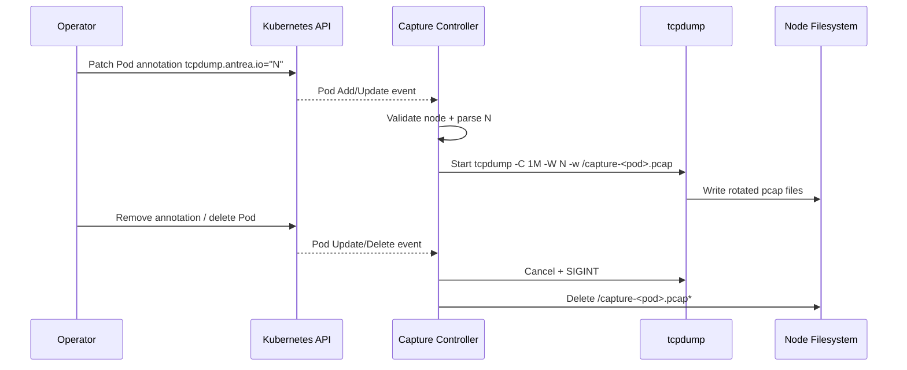

## Antrea Packet Capture Controller

## Table of Contents
- [Project Overview](#project-overview)
- [Objectives](#objectives)
- [Use Cases](#use-cases)
- [Core Features](#core-features)
- [System Architecture](#system-architecture)
- [Architecture Diagram](#architecture-diagram)
- [Data Flow / Request Lifecycle](#data-flow--request-lifecycle)
- [Project Structure](#project-structure)
- [Tech Stack & Justification](#tech-stack--justification)
- [Key Design Decisions](#key-design-decisions)
- [Trade-offs](#trade-offs)
- [API Design](#api-design)
- [Data Modeling](#data-modeling)
- [Security Considerations](#security-considerations)
- [Performance Considerations](#performance-considerations)
- [Scalability Approach](#scalability-approach)
- [Observability & Monitoring](#observability--monitoring)
- [Testing Strategy](#testing-strategy)
- [Failure Handling](#failure-handling)
- [Constraints & Assumptions](#constraints--assumptions)
- [Deployment Approach](#deployment-approach)
- [Limitations](#limitations)
- [Future Improvements](#future-improvements)
- [Learnings](#learnings)
- [Author](#author)

---

## Project Overview
This project implements a node-local Kubernetes controller that enables on-demand packet capture for Pods through a single annotation (`tcpdump.antrea.io`). It solves a practical debugging problem: collecting packet-level evidence without permanently running capture agents across the cluster. In real environments, this pattern is useful for transient incident response, network policy verification, and service-to-service traffic validation with low operational friction.

## Objectives
This project demonstrates:
- Event-driven controller design with Kubernetes informers
- Safe process lifecycle management for host-level packet capture
- Practical cluster security trade-offs (privileged DaemonSet with minimal RBAC)
- Operational reasoning for cleanup, idempotency, and node affinity
- Clear separation of deployment artifacts, runtime code, and validation outputs

## Use Cases
Real-world scenarios:
- Investigating intermittent east-west connectivity issues
- Validating NetworkPolicy behavior at packet level
- Capturing evidence during production incident triage windows

Example user flow:
1. Operator annotates a Pod with `tcpdump.antrea.io: "5"`.
2. Node-local controller detects the update and starts capture with 5-file rotation.
3. Operator inspects generated pcap files for packet-level analysis.
4. Operator removes annotation; controller stops capture and deletes files.

## Core Features
### Capture Orchestration
- Annotation-driven start, update, and stop logic
- Dynamic rotation factor (`N`) parsed from annotation value
- Automatic restart when `N` changes

### Node-local Execution Model
- DaemonSet deployment ensures one controller per node
- Controller only acts on Pods scheduled to the same node

### Cleanup and Safety
- Capture process cancellation on annotation removal, Pod deletion, or shutdown
- File cleanup via deterministic naming pattern (`/capture-<pod>.pcap*`)
- Tombstone handling for robust delete events

## System Architecture
High-level components:
- **Client/Operator**: applies or removes Pod annotations
- **Controller (Go)**: watches Pod events, manages tcpdump processes
- **Kubernetes API Server**: source of Pod state changes
- **Node Runtime**: executes tcpdump with privileged access
- **Capture Storage (Node FS)**: temporary pcap files on host filesystem
- **External Analysis Tooling**: Wireshark/tcpdump consumers for pcap review

## Architecture Diagram
```mermaid
flowchart LR
    O[Operator] -->|Annotate Pod| K8S[Kubernetes API Server]
    K8S -->|Watch Events| C[Capture Controller DaemonSet Pod]
    C -->|Node Filter by NODE_NAME| N[Local Node]
    C -->|Start/Stop tcpdump| T[tcpdump Process]
    T -->|Write Rotating Files| F[/capture-pod.pcap*]
    A[Analyst Tooling] -->|Read pcap artifacts| F
```

The design keeps control-plane coordination in Kubernetes while forcing packet capture execution to the Pod’s local node, which avoids cross-node process management complexity.

## Data Flow / Request Lifecycle


## Project Structure
- `cmd/capture-controller/`: controller runtime and event handling logic
- `deploy/`: Kubernetes manifests (RBAC, DaemonSet, test Pod)
- `artifacts/`: verification outputs and evidence
- `Dockerfile`: multi-stage image build for runtime packaging
- `kind-config.yaml`: local cluster topology configuration

Why this structure:
- Runtime code is isolated from infrastructure manifests.
- Operational artifacts are preserved separately for reviewability.
- The layout scales well for adding tests, packages, or admission logic later.

## Tech Stack & Justification
- **Go 1.22**: low-latency concurrency and predictable static binary build
- **Kubernetes client-go / informers**: production-grade watch/cache primitives
- **tcpdump**: battle-tested packet capture utility with native file rotation
- **DaemonSet deployment model**: natural fit for node-scoped packet capture execution
- **Ubuntu runtime image**: simple base with required capture tooling availability

## Key Design Decisions
- **Annotation as control plane**: avoids custom CRD complexity for a demo-grade solution.
- **Node-local filtering (`spec.nodeName`)**: guarantees controller only manages local captures.
- **In-memory active-process map**: simple and fast state tracking for running captures.
- **Signal-based stop + cleanup**: explicit process termination followed by deterministic file deletion.

## Trade-offs
- **Chosen**: Pod annotation contract for simplicity.
  **Alternative**: dedicated CRD with validation/webhooks.
  **Reason**: lower implementation overhead for demonstration scope.

- **Chosen**: privileged DaemonSet with host networking.
  **Alternative**: eBPF or sidecar-based capture patterns.
  **Reason**: predictable tcpdump behavior and straightforward portability.

- **Chosen**: local ephemeral file storage.
  **Alternative**: stream to object storage.
  **Reason**: keeps architecture minimal and easy to reason about.

## API Design
This project does not expose an HTTP API. Its operational API is the Kubernetes Pod annotation contract:

- **Trigger field**: `metadata.annotations["tcpdump.antrea.io"]`
- **Value semantics**: positive integer `N` for file rotation count

Sample control request:
```yaml
apiVersion: v1
kind: Pod
metadata:
  name: example
  annotations:
    tcpdump.antrea.io: "3"
```

Controller action result (conceptual):
- Start: `tcpdump -C 1M -W 3 -w /capture-example.pcap`
- Stop: terminate process and delete `/capture-example.pcap*`

Design philosophy:
- Reuse Kubernetes-native mutation workflows instead of introducing a separate service surface.

## Data Modeling
Primary runtime entities:
- **Pod**: source of desired capture intent (`annotation`, `nodeName`, lifecycle state)
- **CaptureProcess**: in-memory tuple of `process handle`, `cancel func`, and `rotation N`
- **Capture Files**: deterministic `capture-<pod>.pcap*` naming for lifecycle coupling

Relationship model:
- One Pod (on local node) maps to at most one active capture process.
- One active capture process maps to up to `N` rotated pcap files.

## Security Considerations
- RBAC is constrained to Pod `get/list/watch` operations only.
- Privileged execution is required by packet capture capabilities.
- Input validation enforces `N > 0`; invalid values trigger stop behavior.
- Annotation-driven control keeps the write surface limited to Kubernetes-authorized users.
- Cleanup logic reduces residual sensitive packet data persistence on nodes.

## Performance Considerations
- Informer-based watch avoids expensive polling.
- In-memory process map provides O(1) active capture lookup.
- Early node filter (`pod.Spec.NodeName`) prevents unnecessary work on non-local Pods.
- Rotation (`-W N`, `-C 1M`) bounds disk growth during long capture windows.

## Scalability Approach
- Horizontal scale follows cluster node count via DaemonSet replicas.
- Work is naturally partitioned per node; no cross-node coordination is needed.
- Controller logic is stateless across nodes, minimizing distributed consistency requirements.
- Future scale path can add centralized artifact export without changing eventing model.

## Observability & Monitoring
Current observability:
- Controller process logs for start/exit/error paths
- Event-driven behavior visible via Pod state and annotation updates

Recommended production-grade extensions:
- Structured logging with capture identifiers
- Prometheus counters (captures started/stopped/failed)
- Duration histograms for active capture sessions
- Alerting on abnormal tcpdump exit rates

## Testing Strategy
Current approach:
- Functional validation through a traffic generator Pod and artifact inspection
- Manual lifecycle checks for annotation add/update/remove and Pod deletion

Recommended expansion:
- Unit tests for annotation parsing and state transitions
- Informer event simulation tests
- Integration tests in Kind for end-to-end capture lifecycle behavior

## Failure Handling
- Invalid annotation values: capture is stopped to fail safe.
- Pod deletion events: explicit delete and tombstone paths are handled.
- tcpdump start failure: logged and not registered as active.
- Controller shutdown: active captures are canceled and cleaned up.
- File cleanup errors are tolerated to keep control loop resilient.

## Constraints & Assumptions
- Assumes Linux nodes where tcpdump can run with required privileges.
- Assumes users controlling annotations are trusted cluster operators.
- Assumes packet captures are temporary troubleshooting artifacts, not long-term telemetry.
- Assumes moderate per-node capture concurrency for demonstration-scale usage.

## Deployment Approach
- Containerized Go binary with tcpdump in runtime image
- Kubernetes DaemonSet for one controller instance per node
- Dedicated namespace and service account with cluster-scoped read-only Pod watch permissions
- Suitable for local and lab environments, with direct extension path to managed clusters

## Limitations
- No persistence/export pipeline for pcap files.
- No admission policy enforcing annotation value bounds.
- Minimal logging structure; no metrics endpoint yet.
- No multi-tenant isolation guarantees for node-level capture artifacts.

## Future Improvements
- Add CRD-based policy and richer capture configuration
- Stream artifacts to object storage with retention controls
- Add Prometheus/OpenTelemetry instrumentation
- Implement configurable BPF filters and namespace-level allowlists
- Add automated test coverage for informer-driven state machine behavior

## Learnings
- Kubernetes informers are highly effective for low-latency control loops.
- Node-scoped workload design significantly simplifies distributed process control.
- Operational simplicity often wins for debugging tools, but security posture must stay explicit.
- Deterministic cleanup paths are as important as start logic in incident tooling.

## Author
- Name: _Your Name_
- Role: Senior Software Engineer
- Contact: _your.email@example.com_
- Portfolio / GitHub: _https://github.com/your-handle_
